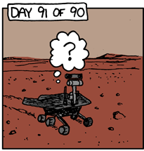

<a href="./LICENSE.md">

</a>

# The Mars Rover Problem in Kotlin

Tackle the
[Mars Rover Problem](http://www.techinterviewpuzzles.com/2010/09/mars-rovers-thoughtworks-puzzles.html)
in Kotlin. This code is a "finger exercise" written for pleasure.

<a href="https://xkcd.com/695/">

</a>

**Note**: _This is no longer a problem offered by ThoughtWorks._

[](https://github.com/binkley/kotlin-rover/actions)
[](https://github.com/binkley/kotlin-rover/issues/)
[](http://unlicense.org/)

## Build and try

To build, use `./mvnw clean verify`.

Try `./run < src/test/resources/input` for a demonstration.

There are no run-time dependencies beyond the Kotlin standard library.

To build as CI would, use `./batect build`.

Try `./batect run` for a demonstration as CI would.

---

## TOC

* [Build and try](#build-and-try)
* [Problem statement](#problem-statement)
* [Remarks](#remarks)
* [Approach](#approach)
* [Releases](#releases)
* [Further reading](#further-reading)

---

## Problem statement

A squad of robotic rovers are to be landed by NASA on a plateau on Mars. This
plateau, which is curiously rectangular, must be navigated by the rovers so
that their on-board cameras can get a complete view of the surrounding terrain
to send back to Earth. A rover’s position and location is represented by a
combination of x and y coordinates, and a letter representing one of the four
cardinal compass points. The plateau is divided up into a grid to simplify
navigation. An example position might be 0, 0, N, which means the rover is in
the bottom left corner and facing North. In order to control a rover, NASA
sends a simple string of letters. The possible letters are ‘L’, ‘R’ and ‘M’.
‘L’ and ‘R’ make the rover spin 90 degrees left or right respectively, without
moving from its current spot. ‘M’ means move forward one grid point, and
maintain the same heading. Assume that the square directly North from (x, y)
is (x, y+1).

### Input

* The first line of input is the upper-right coordinates of the plateau, the
  lower-left coordinates are assumed to be 0,0.
* The rest of the input is information pertaining to the rovers that have been
  deployed. Each rover has two lines of input. The first line gives the
  rover’s position, and the second line is a series of instructions telling
  the rover how to explore the plateau.
* The position is made up of two integers and a letter separated by spaces,
  corresponding to the x and y coordinates and the rover’s orientation.
* Each rover will be finished sequentially, which means that the second rover
  won’t start to move until the first one has finished moving.

### Output

* The output for each rover should be its final coordinates and heading.

### Example

#### Input

```
5 5
1 2 N
LMLMLMLMM
3 3 E
MMRMMRMRRM
```

#### Expected Output

```
1 3 N
5 1 E
```

---

## Approach

The Rover Problem describes a series of vector additions in terms of simple
commands to a hypothetical Mars Rover vehicle.

I ignore that the grid is rectangular, and has edges. Mars is a sphere
(roughly), not a plane, so is finite yet unbounded.

The rover may 1) turn left (L), 2) turn right (R), or 3) move forward 1. It
has an initial compass orientation relative to the Euclidean plane, and begins
at the origin. There are no restrictions on the instructions; the vehicle may
spin in a circle or traverse a lengthy line or any mixture of these.

Your goal is to state the final plane coordinates and orientation of the
vehicle after processing the instruction string.

### Vectors

The initial orientation sets the direction of the first vector. Any sequence
of turns is the sum of each turn, e.g., turning left twice is pointing in the
opposite direction.

So the vectors are a direction and a distance, as learned in grade school, and
one initially sums the turns before encountering the first distance.
Thereafter the instruction string can be treated as a sum of vectors:

&sum; _dir_ &times; _dist_

### Parsing

1. Treat the initial orientation as a sequence of turn instructions prefixed
   to the instruction string.
2. Read the instruction string as a series of pairs: a direction (sequence of
   turns) paired with a distance (a sequence of moves).
3. Each vector takes the previous vector for its initial direction.
4. Ignore unpaired trailing turn instructions at the end of the string.

### Calculation

Distances are simple sums of the X-axis 1-vector, ``[ 1 0 ]``. So three (3)
move instructions in sequence is ``[ 3 0 ]``.

Recalling that rotations may be represented in the 2-plane as square matricies
using the Circle Group, SO(2):

| Rotation | 2x2 Matrix       |
|----------|------------------|
| 0        | ``[  1  0, 0  1 ]`` |
| &pi;/2   | ``[  0 -1, 1  0 ]`` |
| &pi;     | ``[ -1  0, 0 -1 ]`` |
| 3&pi;/2  | ``[  0  1, -1  0 ]`` |

Using matrices, rotations are products; distances remain sums. This can be
seen in that ``[ 0 -1, 1 0 ] ^ 3`` (three lefts) is ``[ 0 1, -1 0 ]`` (one
right).

### Solution styles

I presented these
solutions&mdash;["C" style](./src/main/kotlin/hm/binkley/rover/CStyle.kt) and
["math" style](src/main/kotlin/hm/binkley/rover/Oopy.kt)&mdash;to
coworkers, both of which surprised them. I expected that
[matrix form](https://en.wikipedia.org/wiki/Rotation_matrix) of
[the circle group](https://en.wikipedia.org/wiki/Circle_group) is unfamiliar
to most. Myself, I was surprised that the "C" style was unfamiliar! None I
spoke with had familiarity with "C" or FORTRAN or other classical means of
programming. In fact, the "math" style, though abstract algebra was not
understood, spoke more to them by its use of OOP.

An actual Mars Rover would code using the "C" style approach&mdash;you have
limited hardware, harsh conditions, and need absolute certainty of
correctness, something more easily confirmed automatically with a "C"
style of code than OOP. Automated or formal verification
is [an important CS research
area](https://en.wikipedia.org/wiki/Formal_verification).

### Problem problems

I note that the problem as given is both _under-specified_ and
_over-specified_. I suspect this is intentional: that the problem-givers are
looking to see if problem-solvers notice, and if so, how they might address.
For example:

- Why does the grid have a boundary limit?
- The sample input does not approach the boundary
- What should be the behavior for invalid input?
- How to manage a "squad" of rovers? Can the crash into each other?
- Why are starting positions for next instruction not the same as ending
  positions after following the current instructions?

An actual Mars Rover would need to handle these sensibly, and they are not, in
fact, simple problems. Consider other programmed hardware, such as a
pacemaker: How to stay alive when there is malformed input to the software?

Honestly I would prefer a solution in
[APL](http://archive.vector.org.uk/art10011550), extremely well-suited to the
task. For the golf version of this problem, APL is ideal. However, I was
unable to find a workable text editor on Mac OS X for the language, not to
mention [keyboard](http://www.users.cloud9.net/~bradmcc/gif/APL_keyboard.gif).

### Errors

To properly diagnose errors in the input requires a "mini-compiler": treat 
the input as a DSL (which it actually is).  For example, a real Mars Rover 
would report to Earth any of these conditions:

- Missing boundary conditions with input data line number (the first line)
- Malformed position line in the alternating subsequent lines with input 
  data line number
- Malformed turn/movement instructions in the post-alternating subsequent 
  lines with input data line number

Tracking line numbers in the input implies a true DSL parser.  This is a 
challenging problem for existing compilers of programming languages, 
solved by most but even so sometimes with difficult corner cases.

---

## Releases

### 4

Ported to Kotlin.

### 3

(Java) Over-engineered math example. Parsing still primitive.

### 2

(Java) "Math"-style works correctly using rotation matrices from the circle
group.

### 1

(Java) Testing. Vanilla "C" version (in Java) works correctly. Quite succinct.

### 0

(Java) It builds. Completely empty otherwise. This is a tracer release for
GitHub.

---

## Further reading

### The problem

- [_Mars Exploration Rovers_](https://mars.nasa.gov/mer/)
- [_Print Detailed Mars
  Facts_](https://mars.nasa.gov/print/?print=detailedfacts)

### The "C" solution

- [_Kotlin/Native for
  Native_](https://kotlinlang.org/docs/reference/native-overview.html)
- [_Kotlin/Native
  interoperability_](https://kotlinlang.org/docs/reference/native/c_interop.html)

### The "math" solution

- [_Circle group_](https://en.wikipedia.org/wiki/Circle_group)
- [_Rotation matrix_](https://en.wikipedia.org/wiki/Rotation_matrix)
- [_Spherical geometry_](https://en.wikipedia.org/wiki/Spherical_geometry)
